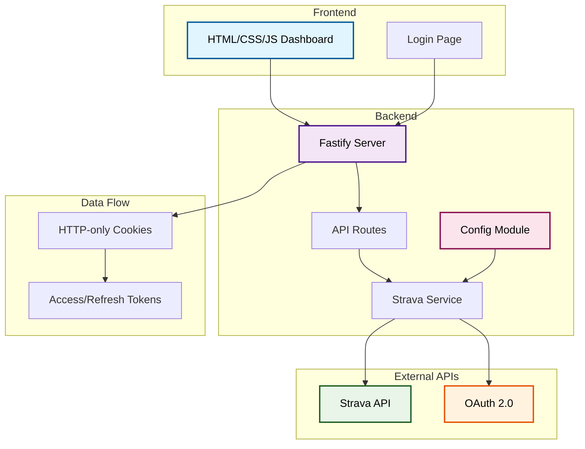

# Strava Kudos Dashboard - A Vibe Coding Experiment

## 🚀 The Experiment

This project started as an attempt to build an automated "kudos reciprocity bot" for Strava. The goal was simple: automatically give kudos back to people who recently gave me kudos.

**What actually happened**: After multiple pivots and discovering API limitations, we ended up with a basic analytics dashboard that shows who's giving you kudos and how frequently.

## 🏗️ What We Built

A **Strava Kudos Analytics Dashboard** with:
- OAuth 2.0 authentication via Strava
- Dashboard showing total kudos and activity metrics
- "Most Active Kudoers" ranking (people who gave kudos in your last 5 activities, ranked by total kudos across all 10)
- **Pattern Analysis**: Activity type preferences and distance-based insights for each kudoer
- Activity breakdown with kudoer lists
- Modern UI with Tailwind CSS

### 🖼️ App Screenshots

#### Dashboard Header & Stats

*Main dashboard with stats cards*

#### Most Active Kudoers Section

*Kudoers ranked by frequency across recent activities*

#### Most Active Kudoers with Pattern Analysis

*Enhanced kudoers table showing activity type preferences and distance patterns*

#### Activities & Kudoers List

*Last 10 activities with their kudoers*

#### Loading State

*Clean loading experience during data fetching*

### 🏛️ Architecture

### 🔧 Technical Stack

- **Backend**: Fastify + TypeScript
- **Frontend**: Vanilla HTML/CSS/JS + Tailwind CSS
- **Authentication**: OAuth 2.0 with HTTP-only cookies
- **API**: Strava API v3
- **Configuration**: Zod-based environment validation

## 🚨 Key Problems Encountered

### API Limitations
- **Webhooks**: Strava doesn't support real-time webhooks for activity updates
- **Kudoer Data**: API only provides names, not IDs for cross-referencing
- **Real-time Updates**: No way to automatically detect new activities from followed athletes

### Technical Debt
- **Multiple Pivots**: Started with JavaScript, converted to TypeScript mid-project
- **Auth Changes**: Switched from .env tokens to OAuth flow
- **Scope Creep**: Built features that were later removed (follower count, webhook infrastructure)

### Implementation Issues
- **DOM Mismatches**: HTML IDs didn't match JavaScript selectors
- **Loading States**: Inconsistent UI state management during data fetching

## 📚 Lessons Learned

### Why Vibe Coding Failed Here

1. **API Constraints**: You can't discover fundamental API limitations while coding
2. **Architecture Drift**: Frequent pivots create messy, hard-to-maintain code
3. **Wasted Effort**: Built infrastructure for concepts that couldn't work
4. **Scope Instability**: Requirements changed constantly without validation

### What We Should Have Done

1. **Research First**: Use AI to explore Strava API capabilities and limitations
2. **Validate Assumptions**: Build small proofs of concept before full implementation
3. **Define Scope**: Set clear boundaries and success criteria upfront
4. **Incremental Design**: Design as we learn, but with clear constraints

## 🎯 Final Assessment

**The Good**: We ended up with a functional, useful dashboard that actually serves a purpose - identifying your most active Strava supporters.

**The Reality**: This is a basic analytics tool, not the automated kudos system we envisioned. It's more of a "kudos insights dashboard" than a "kudos automation platform."

**The Lesson**: Vibe coding without preparation leads to functional but misaligned outcomes. We solved a different problem than the one we set out to address.

## 🔮 Next Time

I plan to try a **different approach to vibe coding**:
- **AI-assisted research** to explore APIs and technologies first
- **Quick prototyping** to validate core assumptions
- **Clear boundaries** for scope and requirements
- **Fail fast** to identify dead ends quickly

**Bottom line**: Spend 30 minutes researching before 3 hours of coding, not the other way around.

---

*This README documents both the final application and the lessons learned from jumping into implementation without proper preparation.*
