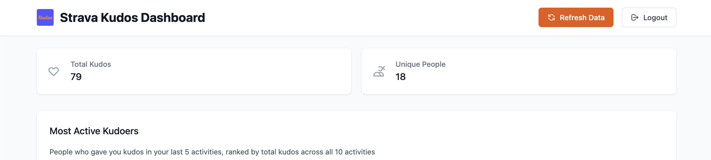
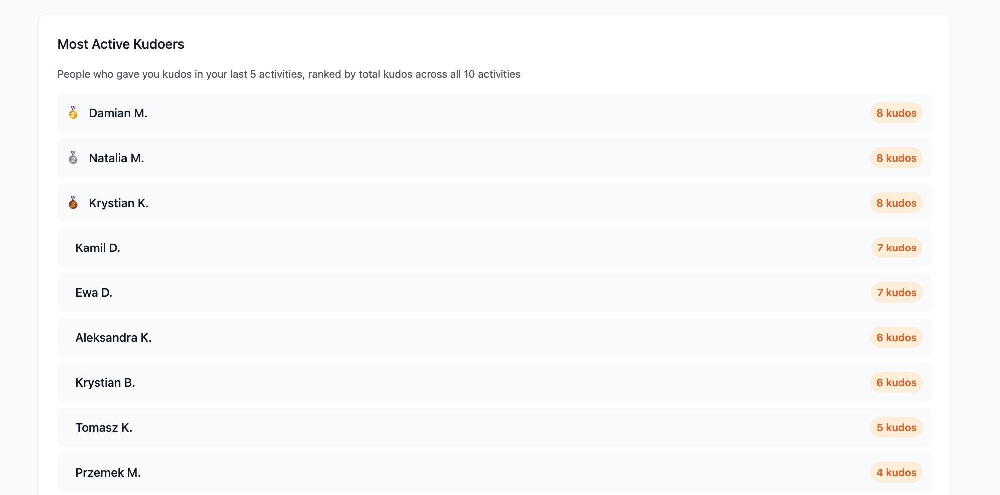
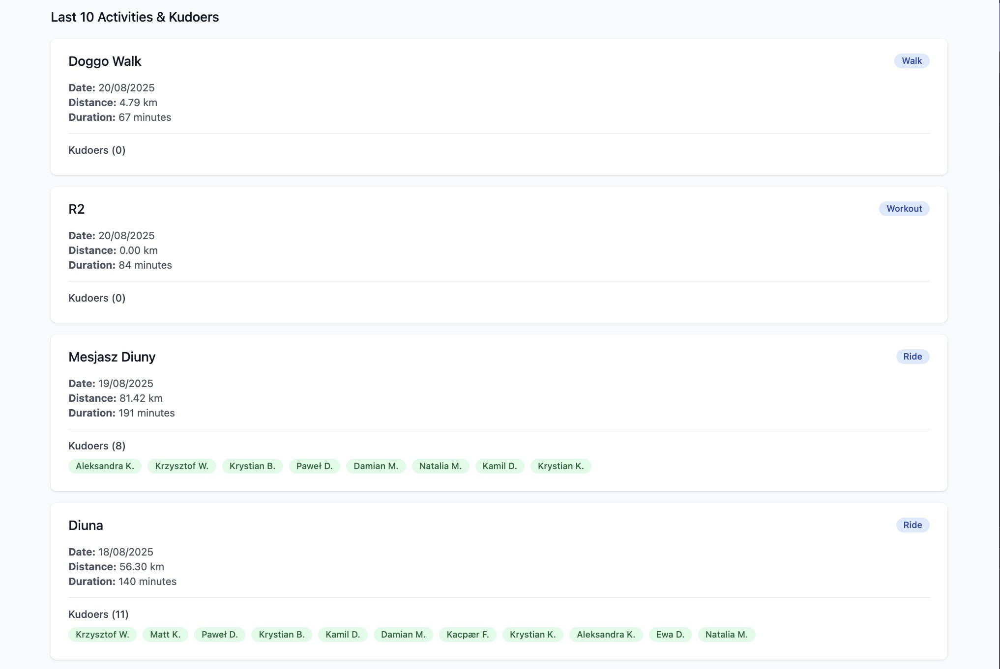
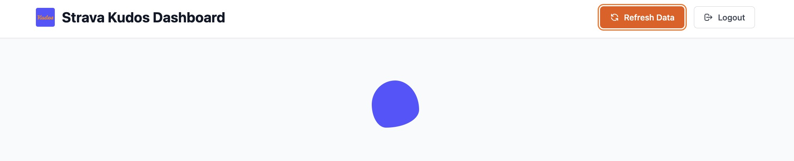
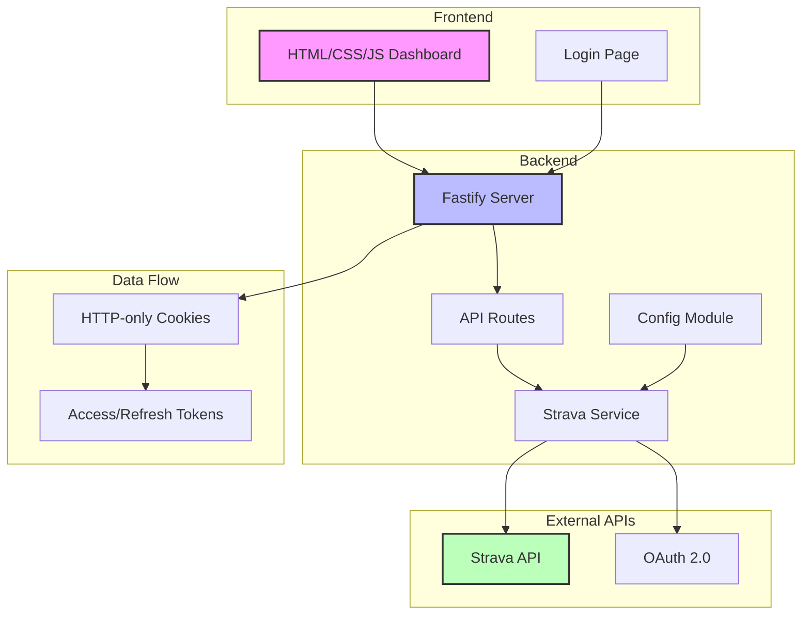

# Strava Kudos Dashboard - A Vibe Coding Experiment

## 🚀 The Experiment: Vibe Coding Without Preparation

This project represents an experiment in "vibe coding" - the practice of jumping straight into implementation without proper research, planning, or understanding of the problem space. The goal was to build an application that automatically gives kudos to Strava followers who recently gave me kudos, but the journey revealed the importance of preparation and research.

### 🎯 Initial Vision vs. Reality

**What I Wanted to Build:**
- Automatically detect when someone I follow uploads a new activity
- Check if they gave me kudos recently
- Automatically give them kudos back
- Create a "kudos reciprocity" system

**What Actually Happened:**
- Discovered Strava API limitations (no webhook support for real-time updates)
- Realized the "auto-kudos" concept was impossible to implement
- Had to pivot multiple times to find a viable solution
- Ended up building something completely different

### 🔄 The Pivot Journey

1. **Initial Approach**: Cron job polling for new activities from followed athletes
2. **Pivot 1**: Switched to webhooks for real-time updates
3. **Pivot 2**: Discovered webhook verification requirements made it impractical
4. **Pivot 3**: Switched back to polling but changed the entire concept
5. **Final Pivot**: Instead of auto-kudos, built a dashboard to analyze kudos patterns

## 🏗️ What We Actually Built

After multiple pivots, we ended up with a **Strava Kudos Analytics Dashboard** - a web application that provides insights into who's giving you kudos and how frequently.

### ✨ Features

- **OAuth 2.0 Authentication** with Strava
- **Dashboard Overview** with key metrics
- **Most Active Kudoers** - people who gave kudos in your last 5 activities, ranked by total kudos across all 10 activities
- **Activity Analysis** - detailed view of your last 10 activities with kudoer lists
- **Real-time Data** - fetches fresh data from Strava API on each refresh
- **Modern UI** with Tailwind CSS and smooth animations

### 🖼️ App Screenshots

#### Dashboard Header & Stats

*The main dashboard showing the header with logo, stats cards for Total Kudos and other metrics*

#### Most Active Kudoers Section

*The "Most Active Kudoers" section displaying people ranked by kudos frequency across recent activities*

#### Activities & Kudoers List

*Detailed view of activities with their respective kudoers, showing the last 10 activities*

#### Loading State

*Clean loading experience showing only the header and animated loader during data fetching*

### 🏛️ Architecture

### 🎯 Final Result vs. Original Vision

**What We Actually Built:**
A simple, functional dashboard that shows who's giving you kudos and how frequently. It's a basic analytics tool that helps you understand your Strava community engagement.

**What We Originally Wanted:**
An intelligent, automated system that would automatically give kudos back to people who recently supported you - essentially a "kudos reciprocity bot" that would maintain social connections automatically.

**The Reality Check:**
While the final app is clean, functional, and actually serves a useful purpose (identifying your most active supporters), it's a far cry from the ambitious automation system we envisioned. It's more of a "kudos analytics tool" than a "kudos automation platform."

**Why This Matters:**
This demonstrates a classic case of scope creep and requirement drift. We started with a complex automation idea and ended up with a simple dashboard. While the final product is useful, it doesn't solve the original problem we set out to address.

### 🔧 Technical Stack

- **Backend**: Fastify + TypeScript
- **Frontend**: Vanilla HTML/CSS/JS + Tailwind CSS
- **Authentication**: OAuth 2.0 with HTTP-only cookies
- **API Integration**: Strava API v3
- **Configuration**: Zod-based environment validation
- **Development**: Hot reload with nodemon

## 🚨 Problems We Encountered

### 🔍 API Limitations Discovery

**Problem**: We didn't research Strava's API capabilities before starting
- **Impact**: Built webhook infrastructure that couldn't work
- **Solution**: Had to completely refactor to polling approach
- **Time Lost**: Several development cycles

**Problem**: Assumed we could get kudoer IDs for cross-referencing
- **Impact**: The API only provides names, not IDs
- **Solution**: Had to redesign the data flow entirely
- **Time Lost**: Multiple iterations of the kudos logic

### 🏗️ Architecture Issues

**Problem**: Started with JavaScript, then converted to TypeScript mid-project
- **Impact**: Had to refactor all files and fix type errors
- **Solution**: Systematic conversion with proper type definitions
- **Time Lost**: Development time for conversion

**Problem**: Authentication flow changed from .env tokens to OAuth cookies
- **Impact**: Had to redesign the entire auth system
- **Solution**: Implemented proper OAuth flow with secure cookies
- **Time Lost**: Multiple auth iterations

### 🐛 Implementation Bugs & Fixes

**Problem**: DOM element ID mismatches between HTML and JavaScript
- **Impact**: Features like "Most Active Kudoers" wouldn't work due to `getElementById` returning null
- **Solution**: Manual fixes to align HTML IDs with JavaScript selectors
- **Lesson**: Inconsistent naming conventions create runtime errors that are hard to debug

**Problem**: Loading state management inconsistencies
- **Impact**: Some UI elements remained visible during loading, creating confusing user experience
- **Solution**: Systematic review and fix of all loading state transitions
- **Lesson**: UI state management requires careful coordination between HTML structure and JavaScript logic

### 🤝 Cooperation Challenges

**Problem**: Multiple pivots made it difficult to maintain consistent direction
- **Impact**: Had to constantly adapt the codebase to new requirements
- **Solution**: Incremental refactoring while maintaining functionality
- **Lesson**: Frequent pivots create technical debt

**Problem**: Some features were implemented then removed (like follower count)
- **Impact**: Wasted development effort
- **Solution**: Better to validate requirements before implementation
- **Lesson**: Feature creep without validation is expensive

## 📚 Key Lessons Learned

### 🚫 Why Vibe Coding Without Preparation is Problematic

1. **API Limitations**: You can't discover API constraints while coding
2. **Architecture Debt**: Frequent pivots create messy, hard-to-maintain code
3. **Wasted Effort**: Features built for concepts that don't work
4. **Scope Creep**: Requirements change constantly without proper planning
5. **Technical Debt**: Quick fixes become permanent problems

### ✅ What We Should Have Done Instead

1. **Research Phase**: Use AI to explore Strava API capabilities and limitations
2. **Design Phase**: Create a proper architecture before writing code
3. **Validation Phase**: Test assumptions with small proofs of concept
4. **Planning Phase**: Define clear requirements and success criteria
5. **Implementation Phase**: Build with confidence based on solid foundation

### 🤖 The Role of AI in Research

AI can be incredibly helpful for initial research, but it should be:
- **Supplemental**: Not the only research method
- **Validated**: Always cross-reference with official documentation
- **Iterative**: Use AI to explore, then manually verify
- **Focused**: Ask specific questions about capabilities and limitations

## 🔮 What's Next

I plan to try a **different approach to vibe coding** - one that combines the creative energy of rapid development with the discipline of proper preparation:

1. **AI-Assisted Research**: Use AI to explore APIs and technologies
2. **Quick Prototyping**: Build small proofs of concept to validate ideas
3. **Incremental Design**: Design as we learn, but with clear boundaries
4. **Fail Fast**: Identify dead ends quickly and pivot strategically
5. **Document Everything**: Keep track of decisions and their rationale

## 🎯 Conclusion

While this project ended up being a functional and useful dashboard, the journey to get there was unnecessarily complex and time-consuming. The lesson is clear: **vibe coding without preparation leads to technical debt, wasted effort, and frustration**.

The sweet spot seems to be combining the energy and creativity of rapid development with the wisdom of proper research and planning. AI tools can significantly accelerate the research phase, but they should be used thoughtfully and validated manually.

**Next time, I'll spend 30 minutes researching before 3 hours of coding, not the other way around.**

---

*This README serves as both documentation and a cautionary tale about the importance of preparation in software development.*
